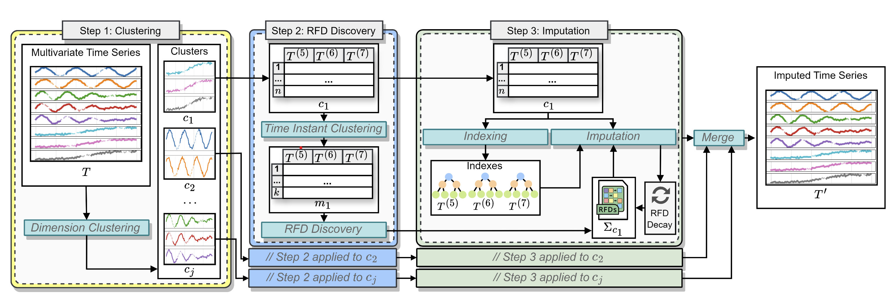
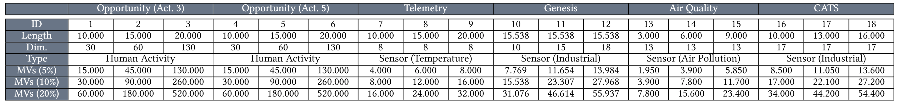
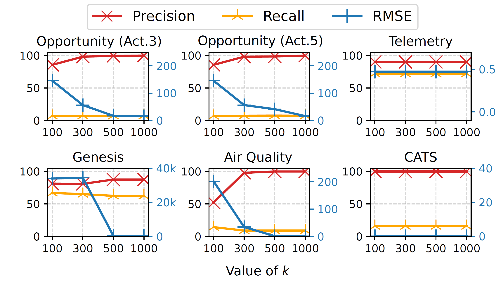
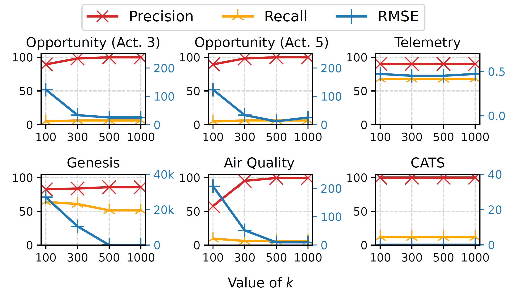

# RIFT: RFD-based Imputation Framework for Time Series

 

This repository contains supplemental material related to the paper *RIFT: Scaling Relaxed Functional Dependencies for Imputing Missing Values in Time series*.

## License

This software is released under the GNU Affero General Public License v3.0 (AGPLv3).

See the full license text at:
https://www.gnu.org/licenses/agpl-3.0.html


## EXPERIMENTAL EVALUATION

In the following, we provide the experiments that were omitted in the paper due to space constraints.  

### Datasets details



The Figure above shows the details of the datasets employed in our evaluation, also reporting the total number of Missing Values for each configuration. These datasets were selected to cover different domains, such as human activity recognition, environmental sensing, industrial automation, and air quality monitoring (i.e., Opportunity, Telemetry, Genesis,and Air Quality, resp.).

### Evaluation metrics

To evaluate the imputations, we consider Precision, Recall and RMSE. Formally, let _tr_ be the number of correct imputations, _imp_ the numberof imputations performed and _miss_ be the number of MVs originally present inthe dataset, then:


### Influence of k with 10% and 20% missing rates

The following Figures reports the effect of the variation of the parameter k on the imputation accuracy with 10% and 20% missing rate (in the paper only results related to 5% missing rate are reported)






## DATASETS

The **Datasets** folder contains both the original datasets (**Starting Datasets** folder) and the datasets with missing values (**Missing Datasets** folder), which were used for the experimental evaluation described in the paper.

The name of the original datasets is composed as follows: "{name}\_{length}\_{number of dimensions}.csv". 
The name of the missing datasets is composed as follows: "{name}\_{length}\_{number of dimensions}\_{number of missing values}\_{version}.csv".

## MISSING VALUES INJECTION

The **Preprocessing** folder includes two scripts for injecting missing values into the datasets in the **Starting_Datasets** folder:

- **injector.py**: Injects missing values according to the MCAR (Missing Completely at Random) mechanism. The parameters of the script are the following:

```
dataset = 'Air'              # Name of the datasets
delimiter = ';'              # Delimiter of the dataset
percentages = [5,10,20]      # Missing rates 
lengths=[3000]               # Lenght of the series
columns=[13]                 # Number of columns/dimensions
iterations = [1]             # This is just a number that will be included in the output file's name, so it is possible to generate different version of the same dataset with the same missing rates
null_value = '?'             # The missing value will be represented with "?"
```
- **injector_block.py**: Injects missing values based on the MNAR (Missing Not At Random) mechanism. Specifically, this script simulates sensor malfunctions by introducing consecutive missing values for a randomly determined time period. This script has the same parameters of  **injector.py**, with the addition of the following one:
```
max_malfunction_duration = 50 # Maximum malfunction duration
```

Both scripts save the resulting datasets in the **Missing Datasets** folder. Additionally, removed values and their original positions are stored in the **Initial_Tuples** folder. These files are necessary for running the imputation algorithm.

## CLUSTERING

### Requirements

Make sure to have the following Python libraries installed:

- pandas
- numpy
- scikit-learn
- scikit-learn-extra
- scipy

The **Clustering** folder contains scripts for implementing the first two steps of the RIFT framework:

- **Dimensions_Clustering.py**: Implements the clustering strategy used in the paper. It partitions the multivariate time series into clusters based on correlations between dimensions while balancing the size of the resulting clusters. The script has the following parameters:

```
min_cluster_size = 6                          # Minimum cluster size
max_cluster_size = 14                         # Maximum cluster size
dataset_name = 'S4-ADL5_20000_130'            # Name of the original dataset
dataset_name_MV = f'{dataset_name}_260000_1'  # Name of the dataset + version details (number of missing values and version)
```
  
- **Time_Instants_Clustering.py**: Implements the clustering strategy used in step 2 of the framework, selecting the *k* most representative time instants. The script has the following parameters:
```
dataset_name = 'S4-ADL5_20000_130'                                       # Name of the original dataset
MVs=520000
version=1
dataset_name_MV = f'{dataset_name}_{MVs}_{version}_Balanced_cluster_10'  # Name of the cluster
k_arr = [100, 300, 500, 1000]                                            # Number of medoids to save
dataset_type = "numeric"                                                 # set to "numeric" if all dimensions are numeric, otherwise use "mixed" 
```
Both scripts save the processed data in the **Missing Datasets** folder, inside the subfolder corresponding to the dataset they were applied to.

## DISCOVERY

After performing the clustering step, it is possible to run an RFD discovery process to extract the RFDs holding for each cluster. For this step, any RFD discovery algorithm can be employed (since every algorithm extracts a set of complete, correct and minimal RFDs the results will be the same). The syntax used to represent the discovered RFDs should be the following:

```
RHS;COL0;COL1;COL2;COL3;COL4;COL5;COL6;COL7;COL8;COL9;COL10;COL11;COL12;COL13;COL14;COL15
COL0;1.0;0.0;?;0.0;0.0;0.0;?;?;?;?;?;?;?;?;?;?
```
Specifically, each RFD is represented by a row. The column **RHS** contains the attribute present in the RHS of the RFD. The attributes whose values are "?" are not involved in the RFD, whereas otherwise its associated similarity threshold is reported. For instance, the example above represents a single RFD: COL1(0.0), COL3(0.0), COL4(0.0), COL5(0.0)-->COL0(1.0).

## IMPUTATION

After performing all the required discovery processes, it is possible to start the imputation step. To this end, the .jar files RIFT and  RIFT+INDEXING can execute the imputation processes on a set of clusters in a sequential way. The imputation process requires (1) the RFD discovered for each cluster, which have to be put inside the RFD folre; (2) the files inside the  **Initial_Tuples** folder, (3) the Header and the ColumnTypes files, which have to be put in the CandidateDataset folder and contains all the informations of all datasets (these files are automatically updated when injecting missing values in the preprocessing step); (4) the datasets, which have to be put in the dataset folder. This repository contains two .jar files: SequentialImputationExecutor performs the imputations process by employing only the decay mechanism, while SequentialImputationExecutorIndexing also adds the use of the indexing strategy. Both jars requires the following arguments:
```
        String basePath = "C:\\Users\\rstan\\eclipse-workspace\\Imputation\\";   //Main Directory that contains the folders described above
        String delim = ";";  //Dataset delimiter
        String nullValue = "?"; //Symbol that represents missing values
        int windowSize = 16000; //Dataset size (temporal instants)
        int clusterRows = 100; //rows used for the discovery step. In this case, the algorithm will use the RFDs discovered with 100 medoids (k)
        int[] clusterIds = {1,2}; //cluster IDs. Here we have two clusters
        int[] attributeCounts = {6,11}; //Number of dimensions in each cluster (e.g. cluster 1 has 6 dimensions)
        String dataset = CATS_16000_17_13600_1 //Dataset name ({name}\_{length}\_{number of dimensions}\_{number of missing values}\_{version})
        thresholds=0.5 //Threshold used for the discovery in the discovery step (required by RENUVER)
```
Thus, they can be executed as follows:
```
java -jar RIFT.jar "C:/Users/rstan/eclipse-workspace/Imputation/" ";" "?" 16000 100 "1,2" "6,11" "CATS_16000_17_13600_1" 0.5
```
